# Architecture

Deep dive into how scoped-mcp works internally.

---

## Module Lifecycle

```mermaid
sequenceDiagram
    participant Env as Environment
    participant S as server.py
    participant Man as manifest.py
    participant Reg as registry.py
    participant Cred as credentials.py
    participant Mod as ToolModule
    participant FM as FastMCP

    rect rgb(15, 52, 96)
        Note over Env,FM: Startup
        Env->>S: AGENT_ID, AGENT_TYPE
        S->>Man: load(manifest_path)
        Man-->>S: modules[], credentials config
        S->>Reg: discover + filter modules
        Reg->>Cred: resolve credentials for each module
        Cred-->>Reg: injected contexts
        Reg->>Mod: instantiate with context + scope
        Reg->>FM: register tools (filtered by mode)
        FM-->>S: server ready
    end

    rect rgb(26, 26, 46)
        Note over Env,FM: Runtime (per tool call)
        FM->>Mod: tool_call(args)
        activate Mod
        Note right of Mod: @audited wrapper logs the call
        Mod->>Mod: scope.enforce(args) inside tool method
        alt scope violation
            Mod-->>FM: ScopeError (blocked + logged)
        else within scope
            Mod->>Mod: execute tool logic
            Mod-->>FM: result (logged)
        end
        deactivate Mod
    end
```



---

## How Scoping Works

Scope enforcement is the security boundary. Every tool method must call its scope strategy's `enforce()` — or validate the argument against an explicit allowlist for modules where the scope is an allowlist rather than a transformable value (Grafana datasource names, SMTP recipients, ntfy topics) — before any backend operation.

The `@audited` decorator — applied by the registry, never by module authors — wraps every tool call with structured audit logging. It does NOT enforce scope: each module is responsible for scope enforcement in its own tool methods. See `AGENTS.md` for the module-author enforcement checklist.

### Three built-in strategies

**PrefixScope** — for file paths, object storage keys, any prefix-addressable resource.

```
base_path/agents/{agent_id}/subpath
```

PrefixScope resolves symlinks before checking, so a symlink pointing outside the prefix is treated as a scope escape. Traversal (`../`) is caught by resolving to an absolute path before comparing against the agent root.

**Per-agent file** — used by the sqlite module for real isolation.

```
{db_dir}/agent_{agent_id}.db
```

Each agent gets its own SQLite file, so two agents cannot read or write each other's data regardless of SQL shape. The sqlite module also parses SQL with sqlglot to block PRAGMA, ATTACH, DETACH, DROP, and multi-statement batches as defense in depth. (A previous `SchemaScope` strategy targeted this use case but did not actually isolate — see the 2026-04-16 audit, finding C1. The class remains in `scoped_mcp.scoping` for backwards compatibility only.)

**NamespaceScope** — for key-value stores, message queue topics, time-series buckets.

```
{agent_id}:key
```

Used by the InfluxDB module for bucket allowlist enforcement and by custom modules that namespace into shared key-value stores.

### Implementing a custom strategy

```python
from scoped_mcp.scoping import ScopeStrategy, ScopeViolation
from scoped_mcp.identity import AgentContext

class BucketScope(ScopeStrategy):
    def apply(self, value: str, agent_ctx: AgentContext) -> str:
        return f"{agent_ctx.agent_id}-{value}"

    def enforce(self, value: str, agent_ctx: AgentContext) -> None:
        prefix = f"{agent_ctx.agent_id}-"
        if not value.startswith(prefix):
            raise ScopeViolation(f"Bucket '{value}' is outside agent scope")
```

---

## Credential Flow

```
Environment (env vars or secrets file)
    │
    ▼
credentials.py (resolve_credentials)
    │  reads CREDENTIAL_KEY from env or YAML
    │  raises CredentialError (key name, never value) if missing
    ▼
registry.py → ToolModule.__init__(credentials={...})
    │  credentials dict injected at instantiation
    │  never passed back to the agent in any tool response
    ▼
module tool methods (self.credentials["KEY"])
    │  used directly in HTTP headers, client constructors, etc.
    │  audit.py sanitizes: any key ending in _TOKEN, _PASSWORD, _SECRET, _KEY
    │    → replaced with "<redacted>" in log output
    ▼
structlog audit processor
    │  _sanitize_processor runs on every log event
    │  cannot be bypassed by module code
```

---

## Audit Pipeline

Every tool call produces one JSON-L line on stdout. Scope violations produce a `warning`-level line instead of `info`.

**Audit log entry (successful call):**
```json
{
  "ts": "2026-04-15T21:45:00.123Z",
  "level": "info",
  "logger": "audit",
  "tool": "filesystem_read_file",
  "agent_id": "research-01",
  "args": {"path": "notes.md"},
  "status": "ok",
  "elapsed_ms": 12
}
```

**Scope violation:**
```json
{
  "ts": "2026-04-15T21:45:01.456Z",
  "level": "warning",
  "logger": "audit",
  "tool": "filesystem_read_file",
  "agent_id": "research-01",
  "args": {"path": "../../build-01/secrets.env"},
  "status": "blocked",
  "error": "Path '../../build-01/secrets.env' is outside the agent scope",
  "elapsed_ms": 0
}
```

**Sanitization rules:**
- Keys ending in `_TOKEN`, `_PASSWORD`, `_SECRET`, `_KEY`, `_CREDENTIALS` → `"<redacted>"`
- Strings longer than 500 chars → truncated with byte count
- Binary data → `"<binary N bytes>"`

---

## Threat Model

### What scoped-mcp protects against

- **Horizontal data access** — Agent A reading Agent B's files, database rows, or metrics buckets.
- **Credential exposure** — Agents knowing API keys, passwords, or webhook URLs for backends they use.
- **Scope creep** — An agent receiving a tool in read mode and attempting a write operation.
- **Traversal attacks** — Path traversal (`../`), schema injection, bucket namespace collisions.
- **SSRF via http_proxy** — Requests to internal IP ranges, metadata endpoints, or localhost blocked at proxy init and per-request.

### What scoped-mcp does NOT protect against

- **Prompt injection** — An agent receiving malicious content in a tool response and acting on it. Use a separate policy engine for this.
- **Network-level isolation** — scoped-mcp enforces logical boundaries, not network boundaries. For true isolation, run agents in separate network namespaces.
- **Compromised scoped-mcp process** — If the proxy process itself is compromised, all bets are off. Run with minimal OS privileges.
- **Unix user isolation** — scoped-mcp runs as a single OS user. For process-level isolation, run each agent's proxy in a separate container or VM.
- **Encrypted transit** — Transport security (TLS between agent and proxy) is out of scope. Use stdio transport (default) or configure TLS at the OS/network layer.

---

## Extension Points

**Custom modules** — Subclass `ToolModule`, implement `@tool`-decorated methods, add to `src/scoped_mcp/modules/`. The registry discovers them automatically.

**Custom scoping strategies** — Implement `ScopeStrategy.apply()` and `ScopeStrategy.enforce()`.

**Additional credential sources** — Extend `credentials.py` with new sources (Vault, SSM Parameter Store, etc.).

**Post-v0.1 roadmap ideas:**
- Per-tool scoping (more granular than per-module)
- SSE/HTTP transport (currently stdio only)
- Loki/OTLP log forwarding (currently stdout only)
- Helm-specific modules as a separate `helm-scoped-mcp-modules` package
