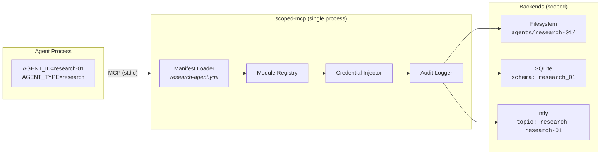
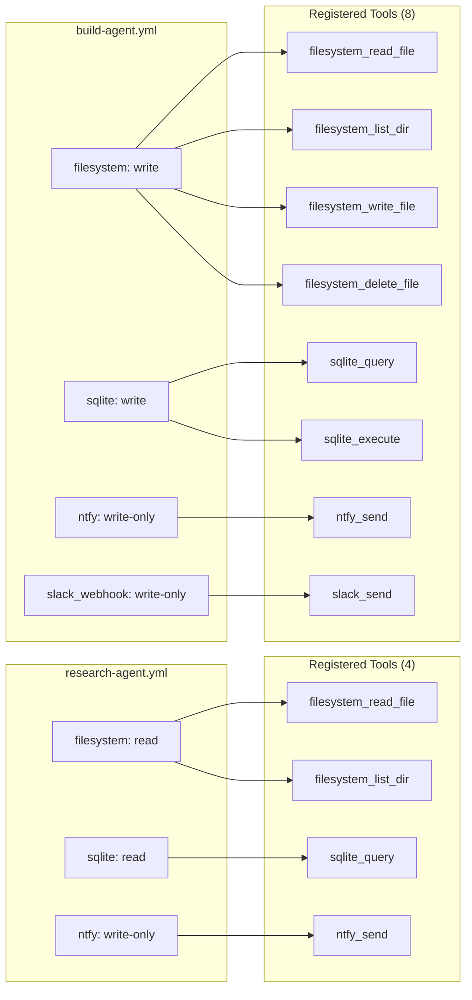

# scoped-mcp

Per-agent scoped MCP tool proxy. One server process per agent — loads only the tools that agent is allowed to use, enforces resource boundaries between agents, holds credentials so agents never see them, and logs every tool call to a structured audit trail.

---

## The Problem

Multi-agent setups (Claude Code subagents, parallel workers, role-based agents) share the same MCP servers. Every agent sees every tool. Every agent holds credentials. Agent A can read Agent B's data. Audit logging is fragmented across a dozen server processes.

Existing solutions solve pieces:
- **Aggregation gateways** — combine servers, no scoping
- **Access control proxies** — filter tools per agent, no resource scoping
- **Credential proxies** — isolate credentials, no tool management
- **Enterprise gateways** — governance and auth, but cloud and team-oriented

None combine all four: **tool filtering + resource scoping + credential isolation + audit logging**.

---

## How It Works

```
Agent process (AGENT_ID=research-01, AGENT_TYPE=research)
    │
    ▼
┌─────────────────────────────────────────┐
│  scoped-mcp (one process per agent)     │
│                                         │
│  ① Load manifest for AGENT_TYPE         │
│  ② Register allowed tool modules        │
│  ③ Inject credentials into modules      │
│  ④ Every tool call:                     │
│     → enforce resource scope            │
│     → execute tool logic                │
│     → write audit log entry             │
└─────────────────────────────────────────┘
    │           │           │
    ▼           ▼           ▼
 Backend A   Backend B   Backend C
 (scoped)    (scoped)    (scoped)
```



---

## Quickstart

```bash
pip install scoped-mcp

# Set agent identity
export AGENT_ID="research-01"
export AGENT_TYPE="research"

# Run with a manifest
scoped-mcp --manifest manifests/research-agent.yml
```

**Claude Code `settings.json`:**

```json
{
  "mcpServers": {
    "tools": {
      "command": "scoped-mcp",
      "args": ["--manifest", "manifests/research-agent.yml"],
      "env": {
        "AGENT_ID": "research-01",
        "AGENT_TYPE": "research"
      }
    }
  }
}
```

See `examples/claude-code/` for a complete multi-agent setup.

---

## Core Concepts

**Agent Identity** — `AGENT_ID` (unique instance) and `AGENT_TYPE` (role) set via environment variables at spawn time. The manifest maps agent types to allowed modules.

**Tool Modules** — one Python file per backend domain. Each module declares its tools, required credentials, and scoping strategy. The framework handles registration, credential injection, and audit wrapping.

**Scoping Strategies** — reusable patterns for resource isolation:
- `PrefixScope` — file paths, object store keys, cache keys scoped to `agents/{agent_id}/`
- `SchemaScope` — database queries restricted to agent's schema/namespace
- `NamespaceScope` — key-value operations prefixed with agent's namespace
- Custom — implement `ScopeStrategy` for your backend's isolation model

**Credential Injection** — backend credentials (API keys, DSNs, tokens) loaded once by the proxy process from environment variables or a secrets file. Modules receive credentials through their context — the agent process never sees them.

**Logging** — two structured JSON-L streams:

1. **Audit log** — what agents did. Every tool call, every scope check.
2. **Operational log** — what the server did. Startup, shutdown, config errors.

---

## Manifest Format

```yaml
# manifests/research-agent.yml
agent_type: research
description: "Read-only research agent"

modules:
  filesystem:
    mode: read                # read-only: read_file + list_dir only
    config:
      base_path: /data/agents # PrefixScope adds /{agent_id}/ automatically

  sqlite:
    mode: read
    config:
      db_path: /data/shared.db

  ntfy:                       # write-only — no mode field needed
    config:
      topic: "research-{agent_id}"
      max_priority: high

credentials:
  source: env                 # or "file" with path: /run/secrets/agent.yml
```

### Manifest-to-Tools Mapping



---

## Built-in Modules

### Storage

| Module | Scope | Read tools | Write tools |
|--------|-------|-----------|-------------|
| `filesystem` | `PrefixScope` — `agents/{agent_id}/` | `read_file`, `list_dir` | `write_file`, `delete_file` |
| `sqlite` | `SchemaScope` — `agent_{agent_id}` | `query`, `list_tables` | `execute`, `create_table` |

### Notifications

Notification modules are **write-only by design** — every agent needs to send alerts, but no agent should see webhook URLs, SMTP passwords, or API tokens.

| Module | Backend | Credential | Scope |
|--------|---------|------------|-------|
| `ntfy` | ntfy.sh (self-hosted or cloud) | Server URL + optional token | Topic per agent (`{agent_id}` template) |
| `smtp` | Any SMTP server | Host, port, user, password | Configured sender + allowed recipients |
| `matrix` | Matrix homeserver | Access token | Room allowlist |
| `slack_webhook` | Slack incoming webhook | Webhook URL | One webhook = one channel |
| `discord_webhook` | Discord webhook | Webhook URL | One webhook = one channel |

### Infrastructure

| Module | Scope | Read tools | Write tools |
|--------|-------|-----------|-------------|
| `http_proxy` | Service allowlist + SSRF prevention | `get` | `post`, `put`, `delete` |
| `grafana` | Folder-based (`agent-{agent_id}/`) | `list_dashboards`, `get_dashboard`, `query_datasource`, `list_datasources` | `create_dashboard`, `update_dashboard`, `create_alert_rule`, `delete_dashboard` |
| `influxdb` | Bucket allowlist + `NamespaceScope` | `query`, `list_measurements`, `get_schema` | `write_points`, `create_bucket`, `delete_points` |

---

## Three-Module Workflow

```
┌─ ops-agent (AGENT_ID=ops-01) ────────────────────────────────────┐
│                                                                   │
│  1. influxdb_query(bucket="metrics",                             │
│       predicate='r._measurement == "docker_cpu"')                │
│     → discovers container X averaging 94% CPU                    │
│                                                                   │
│  2. grafana_create_dashboard(                                     │
│       title="Container Health",                                  │
│       panels=[{"title": "CPU by Container", ...}])               │
│     → dashboard created in folder agent-ops-01/                  │
│                                                                   │
│  3. ntfy_send(title="High CPU: container X",                     │
│       message="Averaging 94% over last hour.")                   │
│     → operator gets push notification                            │
│                                                                   │
└───────────────────────────────────────────────────────────────────┘
```

The agent queried metrics it can see, built a dashboard it owns, and alerted through a channel it's allowed to use. At no point did it see API tokens, access another agent's data, or modify operator dashboards.

---

## Write Your Own Module

```python
# src/scoped_mcp/modules/redis.py
from scoped_mcp.modules._base import ToolModule, tool
from scoped_mcp.scoping import NamespaceScope

class RedisModule(ToolModule):
    name = "redis"
    scoping = NamespaceScope()
    required_credentials = ["REDIS_URL"]

    def __init__(self, agent_ctx, credentials, config):
        super().__init__(agent_ctx, credentials, config)
        import redis.asyncio as aioredis
        self._redis = aioredis.from_url(credentials["REDIS_URL"])

    @tool(mode="read")
    async def get_key(self, key: str) -> str | None:
        """Get a value (scoped to agent namespace)."""
        scoped_key = self.scoping.apply(key, self.agent_ctx)
        return await self._redis.get(scoped_key)

    @tool(mode="write")
    async def set_key(self, key: str, value: str, ttl: int = 0) -> bool:
        """Set a key-value pair (scoped to agent namespace)."""
        scoped_key = self.scoping.apply(key, self.agent_ctx)
        return await self._redis.set(scoped_key, value, ex=ttl or None)
```

Add it to your manifest:
```yaml
modules:
  redis:
    mode: read     # only get_key registered
    config: {}
```

See `examples/custom-module/` for a full walkthrough and `docs/module-authoring.md` for the complete contract.

---

## Comparison to Existing Tools

| Capability | scoped-mcp | agent-mcp-gateway | local-mcp-gateway | Kong MCP |
|---|---|---|---|---|
| Tool aggregation | yes | yes | yes | yes |
| Per-agent tool filtering | manifest | rules file | profiles | RBAC |
| Resource scoping | **yes** | no | no | no |
| Credential isolation | **yes** | no | no | partial |
| Unified audit log | **yes** | no | no | yes |
| Read/write modes | **yes** | per-tool | per-profile | per-role |
| Self-hosted, single process | yes | yes | yes | no |
| Built-in modules | 10 | 0 | 0 | 0 |

---

## Non-Goals

- **Not an enterprise gateway** — no OAuth, no multi-tenant SaaS, no Kubernetes. For self-hosters running multi-agent setups.
- **Not a policy engine** — no prompt injection detection, no tool call classification.
- **Not a process manager** — one MCP server that an agent connects to. Spawning agents is your orchestrator's job.
- **Not E2EE** — the Matrix module supports unencrypted rooms only in v0.1 (no libolm dependency).

---

## Installation

```bash
# Core only (filesystem + sqlite + notifications require no extras)
pip install scoped-mcp

# With HTTP client modules (http_proxy, grafana, influxdb, ntfy, matrix, slack, discord)
pip install "scoped-mcp[http]"

# With SMTP support
pip install "scoped-mcp[smtp]"

# With SQLite async support
pip install "scoped-mcp[sqlite]"

# Everything
pip install "scoped-mcp[all]"
```

## License

MIT
