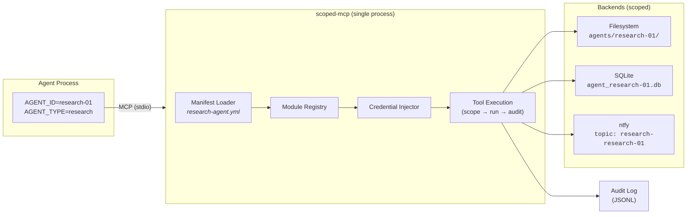
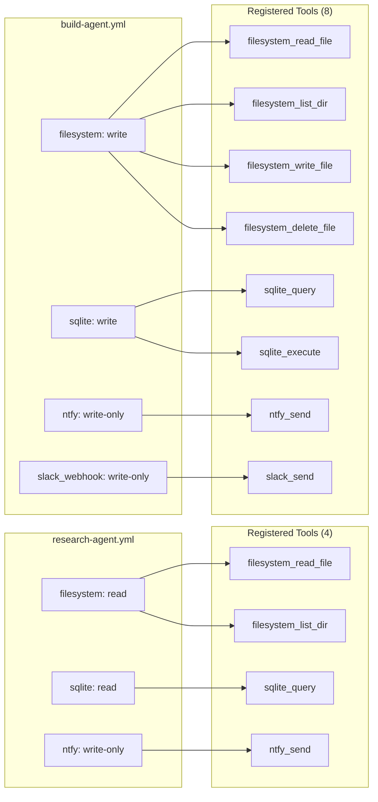

# scoped-mcp

[](https://claude.ai/code)
[](https://github.com/TadMSTR/scoped-mcp/actions/workflows/ci.yml)
[](https://pypi.org/project/scoped-mcp/)
[](https://pypi.org/project/scoped-mcp/)
[](https://opensource.org/licenses/MIT)

Per-agent scoped MCP tool proxy. One server process per agent — loads only the tools that agent is allowed to use, enforces resource boundaries between agents, holds credentials so agents never see them, and logs every tool call to a structured audit trail.

---

## The Problem

Multi-agent setups (Claude Code subagents, parallel workers, role-based agents) share the same MCP servers. Every agent sees every tool. Every agent holds credentials. Agent A can read Agent B's data. Audit logging is fragmented across a dozen server processes.

Existing solutions solve pieces:
- **Aggregation gateways** — combine servers, no scoping
- **Access control proxies** — filter tools per agent, no resource scoping
- **Credential proxies** — isolate credentials, no tool management
- **Enterprise gateways** — governance and auth, but cloud and team-oriented

None combine all four: **tool filtering + resource scoping + credential isolation + audit logging**.

scoped-mcp was built using the same multi-agent pattern it's designed to
secure — a research agent evaluated the problem space, a dev agent implemented
the code, each with scoped access to only the resources it needed. It runs
in production as part of [homelab-agent](https://github.com/TadMSTR/homelab-agent),
a self-hosted Claude Code platform with purpose-built agents for different
infrastructure domains.

---

## How It Works

```
Agent process (AGENT_ID=research-01, AGENT_TYPE=research)
    │
    ▼
┌─────────────────────────────────────────┐
│  scoped-mcp (one process per agent)     │
│                                         │
│  ① Load manifest for AGENT_TYPE         │
│  ② Register allowed tool modules        │
│  ③ Inject credentials into modules      │
│  ④ Every tool call:                     │
│     → enforce resource scope            │
│     → execute tool logic                │
│     → write audit log entry             │
└─────────────────────────────────────────┘
    │           │           │
    ▼           ▼           ▼
 Backend A   Backend B   Backend C
 (scoped)    (scoped)    (scoped)
```


```mermaid
flowchart LR
    subgraph agent["Agent Process"]
        A["AGENT_ID=research-01<br/>AGENT_TYPE=research"]
    end

    subgraph proxy["scoped-mcp (single process)"]
        direction TB
        M["Manifest Loader<br/><i>research-agent.yml</i>"]
        R["Module Registry"]
        C["Credential Injector"]
        EX["Tool Execution<br/>(scope → run → audit)"]

        M --> R
        R --> C
        C --> EX
    end

    subgraph backends["Backends (scoped)"]
        FS["Filesystem<br/><code>agents/research-01/</code>"]
        DB["SQLite<br/><code>agent_research-01.db</code>"]
        NT["ntfy<br/><code>topic: research-research-01</code>"]
    end

    ALOG["Audit Log<br/>(JSONL)"]

    A -- "MCP (stdio)" --> proxy
    EX --> FS
    EX --> DB
    EX --> NT
    EX --> ALOG
```

---

## Quickstart

```bash
pip install scoped-mcp

# Set agent identity
export AGENT_ID="research-01"
export AGENT_TYPE="research"

# Run with a manifest
scoped-mcp --manifest manifests/research-agent.yml
```

**Claude Code `settings.json`:**

```json
{
  "mcpServers": {
    "tools": {
      "command": "scoped-mcp",
      "args": ["--manifest", "manifests/research-agent.yml"],
      "env": {
        "AGENT_ID": "research-01",
        "AGENT_TYPE": "research"
      }
    }
  }
}
```

See `examples/claude-code/` for a complete multi-agent setup.
See `examples/launcher/` for stdio subprocess launcher templates — required when proxying
MCP servers that need credentials, since stdio subprocesses do not inherit the parent env.

---

## Transports

`scoped-mcp run` supports two transports via `--transport` (default `stdio`, unchanged):

| Transport | Process model | Isolation | Auth |
|-----------|---------------|-----------|------|
| `stdio` (default) | one subprocess per turn, spawned by the MCP client | private pipe — no network surface | none needed (implicit) |
| `http` | one long-lived streamable-http process per agent, under PM2 | loopback-only bind | bearer token (required) |

**stdio** is the default and needs no extra flags — it is what the Quickstart and Claude
Code `settings.json` examples above use.

**http** (added v1.6.0) runs scoped-mcp as a persistent streamable-http server so a
per-turn client recycle only drops a connection to a warm process — tool discovery no
longer re-runs and tools never disappear mid-session. It is intended for one long-lived
process per agent, supervised by PM2.

```bash
export AGENT_ID="research-01"
export AGENT_TYPE="research"
export SCOPED_MCP_BEARER_TOKEN="$(openssl rand -hex 32)"   # required for http

scoped-mcp run \
  --manifest manifests/research-agent.yml \
  --transport http \
  --port 9200 \
  --path /mcp            # default; --host defaults to 127.0.0.1
```

HTTP transport constraints:

- **Bearer required** — every request must send `Authorization: Bearer <SCOPED_MCP_BEARER_TOKEN>`.
  Missing or invalid tokens are rejected with `401` before any tool dispatch, using a
  constant-time compare. Startup refuses to run the HTTP transport if the env var is unset.
- **Loopback only** — the server binds `127.0.0.1`; a non-loopback `--host` is refused.
  `--port` is required under `http`.
- **Per-connection audit identity** — each request resolves its own audit `session_id`
  from the MCP connection context, so a single long-lived process still emits distinct
  session ids for concurrent clients. The raw MCP session id is mapped to a stable,
  non-reversible UUID that never leaks into logs.

Client `settings.json` for an HTTP agent points at the URL rather than a command:

```json
{
  "mcpServers": {
    "tools": {
      "type": "http",
      "url": "http://127.0.0.1:9200/mcp",
      "headers": { "Authorization": "Bearer ${SCOPED_MCP_BEARER_TOKEN}" }
    }
  }
}
```

---

## Core Concepts

**Agent Identity** — `AGENT_ID` (unique instance) and `AGENT_TYPE` (role) set via environment variables at spawn time. The manifest maps agent types to allowed modules.

**Tool Modules** — one Python file per backend domain. Each module declares its tools, required credentials, and scoping strategy. The framework handles registration, credential injection, and audit wrapping.

**Scoping Strategies** — reusable patterns for resource isolation:
- `PrefixScope` — file paths, object store keys, cache keys scoped to `agents/{agent_id}/`
- `NamespaceScope` — key-value operations prefixed with agent's namespace
- Per-agent file — e.g. SQLite gives each agent its own database file at `{db_dir}/agent_{agent_id}.db`
- Custom — implement `ScopeStrategy` for your backend's isolation model

**Credential Injection** — backend credentials (API keys, DSNs, tokens) loaded once by the proxy process from environment variables or a secrets file. Modules receive credentials through their context — the agent process never sees them.

**Logging** — two structured JSON-L streams:

1. **Audit log** — what agents did. Every tool call, every scope check. Under stdio each entry carries the process-start `session.id`; under the long-lived HTTP transport the `session.id` is resolved per connection so concurrent clients stay distinguishable.
2. **Operational log** — what the server did. Startup, shutdown, config errors.

Both file sinks use a size-based `RotatingFileHandler` (v1.6.0) so a long-lived HTTP
process cannot grow an unbounded log — tune with `SCOPED_MCP_LOG_MAX_BYTES` (default
50 MiB) and `SCOPED_MCP_LOG_BACKUPS` (default 5). stdio-per-turn behaviour is unchanged.

**Module Startup** — when an agent connects, scoped-mcp starts all proxied/upstream modules concurrently (`asyncio.gather`) rather than one at a time. With ~17 upstream modules this cuts cold-start from ~5.5s to under 1s — roughly the time of the single slowest module — and removes the window where tools are briefly unavailable during per-connection restarts (e.g. under CloudCLI's stream-json driver). (v1.3.2)

**Fault Isolation** — a single module failure does not kill the server. Isolation is applied at three phases (v1.4.0):
- **Import** — if a module file raises on import (missing dependency, syntax error), it is recorded in `failed_imports` and discovery continues. Other modules are unaffected.
- **Init** — if a module's `__init__` raises (bad config, missing credential), it is skipped. Other modules still instantiate and register normally.
- **Startup** — `asyncio.gather` runs with `return_exceptions=True`. A startup failure is recorded in `module_health`; the server yields and remaining modules' tools stay available.

**Module Health** — `scoped_mcp_status` is always registered regardless of manifest content. Call it at session start to get `{modules, failed_count, total_count, healthy}` with per-module status values: `running`, `failed_import`, `failed_init`, `failed_startup`. Set `SCOPED_MCP_HEALTH_FILE` to a path and the lifespan will write a JSON health report after startup completes — useful for session-start hooks or external health-check scripts that need file-based status without calling an MCP tool. (v1.4.0)

**Graceful Shutdown** — scoped-mcp installs a SIGTERM handler that calls `sys.exit(0)`, routing cleanup through FastMCP's lifespan `finally` block and every module's `shutdown()` hook. This ensures open sockets, Vault token-renewal tasks, and `mcp_proxy` subprocess handles are released cleanly when Claude Desktop or Claude Code ends a session. Without this, a SIGTERM kill mid-flight could bypass shutdown hooks and leave orphaned processes. (v1.3.4)

---

## Manifest Format

```yaml
# manifests/research-agent.yml
agent_type: research
description: "Read-only research agent"

modules:
  filesystem:
    mode: read                # read-only: read_file + list_dir only
    config:
      base_path: /data/agents # PrefixScope adds /{agent_id}/ automatically

  sqlite:
    mode: read
    config:
      db_dir: /data/sqlite     # each agent gets /data/sqlite/agent_{agent_id}.db

  ntfy:                       # write-only — no mode field needed
    config:
      topic: "research-{agent_id}"
      max_priority: high

credentials:
  source: env                 # or "file" with path: /run/secrets/agent.yml
  # or: source: vault — see Vault Credentials section

# Optional: pluggable state backend (required for rate limiting and HITL)
state_backend:
  type: in_process            # default — no external deps
  # type: dragonfly
  # url: redis://127.0.0.1:6379/0

# Optional: sliding-window rate limits
rate_limits:
  global: 60/minute           # all tools combined
  per_tool:
    filesystem_write_file: 10/minute
    "mcp_proxy.*": 30/minute  # glob — all matched tools share one counter

# Optional: argument-value filtering
argument_filters:
  - name: no-credentials
    pattern: '(?i)(password|secret|token)\s*[:=]\s*\S+'
    fields: [path, query, body]
    action: block             # or: warn
    decode: [base64, urlsafe_base64, url]

# Optional: human-in-the-loop approval (requires state_backend.type: dragonfly)
hitl:
  approval_required: ["filesystem_delete_*", "sqlite_execute"]
  shadow: ["mcp_proxy.*"]    # log-only, return synthetic empty success
  timeout_seconds: 300
  notify:
    type: ntfy               # or: log (default), webhook, matrix
    topic: homelab-hitl
```

### Environment Variable Substitution

Manifest fields support `${VAR_NAME}` placeholders, expanded from the process environment before YAML parsing:

```yaml
state_backend:
  type: dragonfly
  url: "redis://:${REDIS_PASSWORD}@host:6379/0"  # always quote substitution sites

credentials:
  source: file
  path: "${SECRETS_FILE}"
```

Rules:
- Only the braced form is expanded (`${VAR}`, not `$VAR`) to prevent accidental substitution.
- Undefined variables at startup are a hard error — the agent will not start with incomplete config.
- Expanded values are never written to audit or ops logs.
- **Always YAML-quote fields receiving substitution** — a secret value containing `:`, `{`, or `}` can corrupt the YAML structure if the field is unquoted.

### Top-Level Fields and Strict Validation

The top-level manifest model rejects unknown fields (`extra="forbid"`). A misspelled
or stale key fails the manifest at load time rather than being silently ignored — a
deliberate guard against shadowing attacks, where an unrecognized field could mask a
real setting. Every field an agent platform attaches to its manifests must therefore
be modeled explicitly.

Alongside the operational fields (`modules`, `credentials`, `state_backend`,
`rate_limits`, `argument_filters`, `response_filters`, `hitl`, `audit`), the model
accepts three **platform-metadata** fields. scoped-mcp validates and stores them but
does not act on them — they are consumed by the task dispatcher, agent bus, and other
agents on the platform:

| Field | Type | Purpose |
|-------|------|---------|
| `max_auto_risk` | string | Highest risk tier the agent may auto-approve |
| `interaction_permissions` | `{auto_approved: [...], needs_approval: [...]}` | Cross-agent task auto-approval lists |
| `workspace_access` | list of entries (below) | Filesystem paths the agent may access |

Each `workspace_access` entry (added v1.3.3):

| Key | Type | Default | Purpose |
|-----|------|---------|---------|
| `path` | string | — | Filesystem path the agent may access |
| `access` | `readonly` \| `readwrite` | — | Access mode for the path |
| `git_backed` | bool | `false` | Path is a git repository |
| `branch_required` | bool | `false` | Edits must be made on a branch, not the default branch |

```yaml
workspace_access:
  - path: /srv/agents/research-01
    access: readwrite
    git_backed: true
    branch_required: true
  - path: /srv/shared/reference
    access: readonly
```

`workspace_access` was previously tolerated only because the model briefly loosened to
`extra="ignore"`; modeling it as a typed field lets the top-level model keep
`extra="forbid"` while still validating the block present in every agent manifest.

### Manifest-to-Tools Mapping


```mermaid
flowchart LR
    subgraph manifest_r["research-agent.yml"]
        MR1["filesystem: read"]
        MR2["sqlite: read"]
        MR3["ntfy: write-only"]
    end

    subgraph tools_r["Registered Tools (4)"]
        TR1["filesystem_read_file"]
        TR2["filesystem_list_dir"]
        TR3["sqlite_query"]
        TR4["ntfy_send"]
    end

    MR1 --> TR1 & TR2
    MR2 --> TR3
    MR3 --> TR4

    subgraph manifest_b["build-agent.yml"]
        MB1["filesystem: write"]
        MB2["sqlite: write"]
        MB3["ntfy: write-only"]
        MB4["slack_webhook: write-only"]
    end

    subgraph tools_b["Registered Tools (8)"]
        TB1["filesystem_read_file"]
        TB2["filesystem_list_dir"]
        TB3["filesystem_write_file"]
        TB4["filesystem_delete_file"]
        TB5["sqlite_query"]
        TB6["sqlite_execute"]
        TB7["ntfy_send"]
        TB8["slack_send"]
    end

    MB1 --> TB1 & TB2 & TB3 & TB4
    MB2 --> TB5 & TB6
    MB3 --> TB7
    MB4 --> TB8
```

---

## Built-in Modules

### Storage

| Module | Scope | Read tools | Write tools |
|--------|-------|-----------|-------------|
| `filesystem` | `PrefixScope` — `agents/{agent_id}/` | `read_file`, `list_dir` | `write_file`, `delete_file` |
| `sqlite` | Per-agent DB file — `{db_dir}/agent_{agent_id}.db` | `query`, `list_tables` | `execute`, `create_table` |

### Notifications

Notification modules are **write-only by design** — every agent needs to send alerts, but no agent should see webhook URLs, SMTP passwords, or API tokens.

| Module | Backend | Credential | Scope |
|--------|---------|------------|-------|
| `ntfy` | ntfy.sh (self-hosted or cloud) | Server URL + optional token | Topic per agent (`{agent_id}` template) |
| `smtp` | Any SMTP server | Host, port, user, password | Configured sender + allowed recipients |
| `matrix` | Matrix homeserver | Access token | Room allowlist |
| `slack_webhook` | Slack incoming webhook | Webhook URL | One webhook = one channel |
| `discord_webhook` | Discord webhook | Webhook URL | One webhook = one channel |

### Proxy

| Module | Description | Key config |
|--------|-------------|------------|
| `mcp_proxy` | Forward tool calls to an upstream MCP server (HTTP or stdio) | `url` or `command`, optional `tool_denylist`, `headers` |

`mcp_proxy` connects to upstream MCP servers and re-exposes their tools through scoped-mcp.
Tools are prefixed with the module name (e.g. `memsearch-mcp_search_memory`). Use `tool_denylist`
to hide specific upstream tools from the agent.

**Header injection** — pass custom HTTP headers to upstream streamable-http servers:

```yaml
modules:
  memsearch-mcp:
    type: mcp_proxy
    config:
      url: http://localhost:8493/mcp
      headers:
        Authorization: "Bearer ${MEMSEARCH_API_TOKEN}"
```

Header values support `${VAR}` substitution (same rules as all manifest fields).
Headers are only applied to HTTP transports — configuring headers on a stdio
transport logs a warning and ignores them. `Authorization` header values are
automatically redacted from structured logs.

**Self-healing stdio upstreams** (v1.6.0) — a persistent stdio upstream call that fails
with a dead-transport error (broken/closed pipe, subprocess exit) transparently
reconnects **once** and retries, logging `mcp_proxy_reconnect`. This matters under the
long-lived HTTP transport, where a dead pipe would otherwise persist until restart. The
reconnect is serialized with a lock so concurrent callers do not race to replace the
client; normal tool errors still propagate untouched so real outages are not masked.

### Infrastructure

| Module | Scope | Read tools | Write tools |
|--------|-------|-----------|-------------|
| `http_proxy` | Service allowlist + SSRF prevention | `get` | `post`, `put`, `delete` |
| `grafana` | Folder-based (`agent-{agent_id}/`) | `list_dashboards`, `get_dashboard`, `query_datasource`, `list_datasources` | `create_dashboard`, `update_dashboard`, `create_alert_rule`, `delete_dashboard` |
| `influxdb` | Bucket allowlist + `NamespaceScope` | `query`, `list_measurements`, `get_schema` | `write_points`, `create_bucket`, `delete_points` |

### Credentials

Every module declares its required and optional environment variables. scoped-mcp
fails at startup with a clear error listing any missing required keys — it will not
start partially configured.

| Module | Required env vars | Optional env vars |
|--------|------------------|-------------------|
| `filesystem` | — | — |
| `sqlite` | — | — |
| `ntfy` | `NTFY_URL` | `NTFY_TOKEN` |
| `smtp` | `SMTP_HOST`, `SMTP_PORT`, `SMTP_USER`, `SMTP_PASSWORD` | — |
| `matrix` | `MATRIX_HOMESERVER`, `MATRIX_ACCESS_TOKEN` | — |
| `slack_webhook` | `SLACK_WEBHOOK_URL` | — |
| `discord_webhook` | `DISCORD_WEBHOOK_URL` | — |
| `http_proxy` | — (dynamic; see module config) | — |
| `grafana` | `GRAFANA_URL`, `GRAFANA_SERVICE_ACCOUNT_TOKEN` | — |
| `influxdb` | `INFLUXDB_URL`, `INFLUXDB_TOKEN` | `INFLUXDB_ORG` (overrides `config.org`) |

Credentials are passed in `settings.json` under `env` (for Claude Code) or exported
in the shell before running `scoped-mcp`. They are loaded once at startup, injected
into module contexts, and never returned in tool responses or logged.

For HashiCorp Vault — set `credentials.source: vault` in the manifest with an
`approle` block; credentials are fetched once at startup and the client token is
renewed in the background. Requires `pip install scoped-mcp[vault]`. See
`examples/vault/` for a working manifest, AppRole setup script, and Vault policy.

For integration with a secrets manager such as Vaultwarden, see
`examples/vaultwarden/`.

---

## Three-Module Workflow

```
┌─ ops-agent (AGENT_ID=ops-01) ────────────────────────────────────┐
│                                                                   │
│  1. influxdb_query(bucket="metrics",                             │
│       filters=[{"field": "_measurement",                         │
│                 "op": "==", "value": "docker_cpu"}])             │
│     → discovers container X averaging 94% CPU                    │
│                                                                   │
│  2. grafana_create_dashboard(                                     │
│       title="Container Health",                                  │
│       panels=[{"title": "CPU by Container", ...}])               │
│     → dashboard created in folder agent-ops-01/                  │
│                                                                   │
│  3. ntfy_send(title="High CPU: container X",                     │
│       message="Averaging 94% over last hour.")                   │
│     → operator gets push notification                            │
│                                                                   │
└───────────────────────────────────────────────────────────────────┘
```

The agent queried metrics it can see, built a dashboard it owns, and alerted through a channel it's allowed to use. At no point did it see API tokens, access another agent's data, or modify operator dashboards.

---

## Write Your Own Module

```python
# src/scoped_mcp/modules/redis.py
from scoped_mcp.modules._base import ToolModule, tool
from scoped_mcp.scoping import NamespaceScope

class RedisModule(ToolModule):
    name = "redis"
    scoping = NamespaceScope()
    required_credentials = ["REDIS_URL"]

    def __init__(self, agent_ctx, credentials, config):
        super().__init__(agent_ctx, credentials, config)
        import redis.asyncio as aioredis
        self._redis = aioredis.from_url(credentials["REDIS_URL"])

    @tool(mode="read")
    async def get_key(self, key: str) -> str | None:
        """Get a value (scoped to agent namespace)."""
        scoped_key = self.scoping.apply(key, self.agent_ctx)
        return await self._redis.get(scoped_key)

    @tool(mode="write")
    async def set_key(self, key: str, value: str, ttl: int = 0) -> bool:
        """Set a key-value pair (scoped to agent namespace)."""
        scoped_key = self.scoping.apply(key, self.agent_ctx)
        return await self._redis.set(scoped_key, value, ex=ttl or None)
```

Add it to your manifest:
```yaml
modules:
  redis:
    mode: read     # only get_key registered
    config: {}
```

See `examples/custom-module/` for a full walkthrough and `docs/module-authoring.md` for the complete contract.

---

## Comparison to Existing Tools

The projects below are the closest real comparators in the 2026 MCP-gateway
landscape. All are capable tools — but each targets server-level federation,
container isolation, or team/enterprise RBAC. None isolates resources at the
**per-agent-instance** boundary (Agent A cannot read Agent B's files, rows, or
buckets *even with identical tools*), which is scoped-mcp's core design point.

| Capability | scoped-mcp | [IBM ContextForge][cf] | [Docker MCP Gateway][dmg] | [Stacklok ToolHive][th] | [Kong MCP][kong] |
|---|---|---|---|---|---|
| Tool aggregation | yes | yes | yes | yes | yes |
| Per-agent tool filtering | manifest | RBAC | per-server | RBAC | RBAC |
| **Per-agent resource scoping** | **yes** | no | no | no | no |
| Credential isolation | **yes** | partial | yes | yes | partial |
| Unified audit log | yes | yes (OTel) | partial | yes | yes |
| Read/write modes | **yes** | no | no | no | per-role |
| Self-hosted, single process | **yes** | yes | no (containers) | no (containers/K8s) | no |
| Built-in scoped modules | **10** | 0 | 0 | 0 | 0 |
| Primary audience | self-hosted multi-agent | enterprise federation | dev-local / container | platform teams (K8s) | enterprise API teams |

scoped-mcp does **not** compete with these on OAuth/OIDC, multi-tenant SaaS, or
Kubernetes orchestration — see [Non-Goals](#non-goals). It occupies the gap they
leave: per-agent resource isolation in a single self-hosted process.

[cf]: https://github.com/IBM/mcp-context-forge
[dmg]: https://github.com/docker/mcp-gateway
[th]: https://github.com/stacklok/toolhive
[kong]: https://konghq.com/blog/engineering/mcp-tool-governance-security-meets-context-efficiency

---

## Security

scoped-mcp's core value is security — tool scoping, credential isolation, and
audit logging. To back that up:

- **Threat model:** `docs/threat-model.md` documents the attack surface,
  trust boundaries, and what scoped-mcp does and does not protect against.
- **Audit history:** `docs/security-audit.md` tracks formal internal audits:
  v0.1.0 found 18 findings (1 critical, 3 high, 8 medium, 6 low), remediated
  in v0.2.0; the v0.2.1 follow-up audit returned clean. Post-v1.0 security
  fixes (OTel exception redaction, audit log stdio isolation, ManifestError
  secret suppression) are documented in CHANGELOG.md.
- **Verifiable isolation:** the `examples/claude-code/multi-agent-setup.md`
  includes a step-by-step verification walkthrough — you can confirm filesystem
  isolation and credential non-exposure yourself in under five minutes.

### Optional guardrails

Six opt-in middleware layers sit on top of the core tool/scope/credential/audit
guarantees. All are off by default; enable per-agent in the manifest:

- **OpenTelemetry tracing** (`OTEL_EXPORTER_OTLP_ENDPOINT`, v0.6) — one span per
  tool call with `scoped_mcp.*` attributes (`agent.id`, `agent.type`, `tool.name`,
  `call.status`). Auto-enabled when `OTEL_EXPORTER_OTLP_ENDPOINT` is set in the
  environment. Tool arguments are excluded from spans to prevent credential leakage.
  Works with SigNoz, Grafana Tempo, Jaeger, and Langfuse OTLP ingest. Requires
  `pip install scoped-mcp[otel]`.

- **Rate limiting** (`rate_limits:`, v0.7) — sliding-window per-agent and
  per-tool limits with glob patterns. Backed by `InProcessBackend` (default)
  or `DragonflyBackend` (`[dragonfly]` extra) for cross-process state.
- **Vault-backed credentials** (`credentials.source: vault`, v0.8) — fetch
  credentials from HashiCorp Vault via AppRole; client token auto-renewed in
  the background. See `examples/vault/`.
- **mcp_proxy schema validation + argument filtering** (`argument_filters:`,
  v0.9) — proxied calls are validated against the upstream tool's
  `inputSchema` before forwarding; pattern-based argument filters can block
  or alert on values, with optional base64/url decoding. See
  `docs/threat-model.md` for the documented limits.
- **Human-in-the-loop approval** (`hitl:`, v1.1) — operator-gated tool
  calls using a reject-then-wait design. When an agent calls an
  `approval_required` tool, the middleware rejects immediately with a
  `HitlRejectedError` containing an approval ID and retry instructions —
  the MCP connection stays open. The operator runs
  `scoped-mcp hitl approve <id>`, which writes a one-time pre-approval
  token to Dragonfly (60 s TTL). The agent retries the tool call; the
  middleware finds and consumes the token and forwards the call upstream.
  Shadow-mode tools log a sanitised argument summary and return a
  synthetic empty-success without forwarding upstream — useful for
  observing agent behaviour before enabling a tool.

  CLI subcommands:
  ```
  scoped-mcp hitl list                      # pending approvals
  scoped-mcp hitl approve <approval_id>     # write pre-approval token
  scoped-mcp hitl reject  <approval_id>     # delete pending key
  ```

  Requires `state_backend.type: dragonfly`. Install with
  `pip install scoped-mcp[dragonfly]`.

- **Response filtering** (v1.0.2) — opt-in post-execution content scanning.
  `block`, `warn`, or `redact` modes applied per-field via `ResponseFilterRule`
  entries in the manifest's `audit:` section. Redaction applies to string leaves
  in structured responses only — never to serialized dict/list blobs. See
  `contrib/response_filter.py`.

---

## Non-Goals

- **Not an enterprise gateway** — no OAuth, no multi-tenant SaaS, no Kubernetes. For self-hosters running multi-agent setups.
- **Not a policy engine** — no prompt injection detection, no tool call classification.
- **Not a process manager** — one MCP server that an agent connects to. Spawning agents is your orchestrator's job.
- **Not E2EE** — the Matrix module supports unencrypted rooms only (no libolm dependency).

---

## Installation

```bash
# Core only (filesystem + sqlite + notifications require no extras)
pip install scoped-mcp

# With HTTP client modules (http_proxy, grafana, influxdb, ntfy, matrix, slack, discord)
pip install "scoped-mcp[http]"

# With SMTP support
pip install "scoped-mcp[smtp]"

# With SQLite async support
pip install "scoped-mcp[sqlite]"

# With OpenTelemetry tracing (auto-enabled when OTEL_EXPORTER_OTLP_ENDPOINT is set)
pip install "scoped-mcp[otel]"

# With shared state backend for rate limiting and HITL across processes
pip install "scoped-mcp[dragonfly]"

# With HashiCorp Vault credential source
pip install "scoped-mcp[vault]"

# HTTP + SMTP + SQLite bundle (does not include otel, dragonfly, or vault)
pip install "scoped-mcp[all]"
```

If something isn't working, see [Troubleshooting](docs/troubleshooting.md).

## License

MIT
