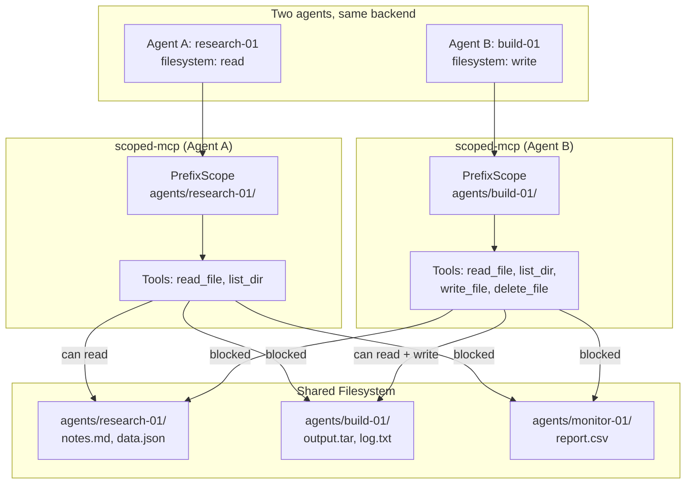

# Scoping Strategies

How resource isolation works, and when to use each strategy.

## The invariant

Every tool call passes through `enforce()` before any backend operation. This is called by the `@audited` decorator, which the registry applies at registration time. Module authors do not call `enforce()` directly — this design prevents accidental omission.

```
Agent calls tool
    → @audited wrapper runs
    → scope.enforce(args, agent_ctx)  ← happens here, before tool logic
    → tool logic executes (or ScopeViolation raised)
    → audit log written
```

## Two agents, same backend



## PrefixScope

For filesystem paths, object storage keys, and any prefix-addressable resource.

**Pattern:** `{base_path}/agents/{agent_id}/{path}`

**Defenses:**
- Resolves symlinks before checking scope — a symlink pointing outside the prefix is an escape attempt
- Handles non-existent paths (write targets) by resolving the nearest existing ancestor, then walks each existing ancestor component to catch operator-seeded symlinks that escape
- Catches `../` traversal by resolving to absolute path before comparing

**Operator guidance:** Do not pre-seed symbolic links inside an agent scope directory. The built-in filesystem module does not create symlinks; if your deployment process does, place them outside any agent scope. The defense-in-depth ancestor-walk catches the common case, but the safest posture is to keep scope directories free of links entirely.

**When to use:** Any resource addressable by a path prefix.

## Per-agent file (SQLite)

For SQLite, each agent gets its own database file.

**Pattern:** `{db_dir}/agent_{agent_id}.db`

**Defenses:**
- Isolation is filesystem-level — agents cannot address another agent's file at all
- sqlglot AST parsing still enforces defense-in-depth: PRAGMA, ATTACH, DETACH, DROP, and multi-statement batches blocked; read-mode tools accept SELECT/WITH only
- `create_table` validates column names against `str.isidentifier()` and column types against a closed allowlist (`INTEGER`, `TEXT`, `REAL`, `BLOB`, `NUMERIC`, `BOOLEAN`, and common `PRIMARY KEY` / `NOT NULL` / `UNIQUE` combinations)

**When to use:** SQLite and other file-backed embedded databases. For server databases (PostgreSQL, MySQL) use role-per-agent auth — not covered by a built-in strategy yet.

**Deprecated:** `SchemaScope` exists in `scoped_mcp.scoping` for backwards compatibility but is not used by any built-in module. The original sqlite implementation used `SchemaScope` + SQLite `ATTACH DATABASE ':memory:'` to namespace agents, but unqualified table references resolved against the shared `main` schema regardless of the attached name — effectively no isolation. See the 2026-04-16 audit (finding C1) for the full trail.

## NamespaceScope

For key-value stores, message queue topics, time-series database buckets.

**Pattern:** `{agent_id}:{key}`

**When to use:** Redis keys, InfluxDB bucket names, NATS subjects, any shared namespace where agents share a store but need isolated keyspaces.

## None (no scoping)

For write-only modules where the credential itself is the scope boundary.

**Examples:** Slack webhook (one URL = one channel), Discord webhook, ntfy with a configured topic.

**When to use:** When the backend's access model is "one credential = one resource." The agent can never exceed the credential's scope because the proxy holds the credential and the agent only provides content.

## Custom strategies

Implement `ScopeStrategy` for backends that don't fit the built-in patterns. See `docs/module-authoring.md` for an example.
